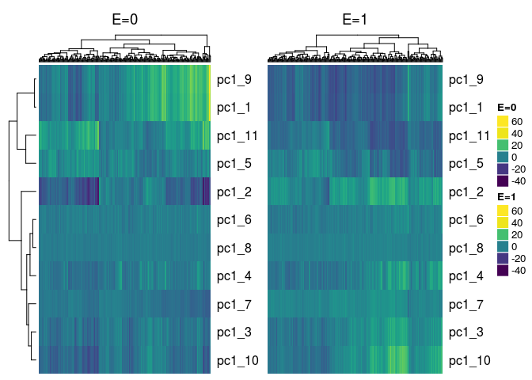

Plots
=====

Plot Method for Object of class `similarity`
--------------------------------------------

There is a plot method for similarity matrices included in this package, though it is very specific to the simulated data only since the resulting plot annotates the true cluster membership of the genes. The plot uses the `pheatmap` package for the heatmaps along with the `viridis` package for the color scheme so these packages need to be installed prior to using this function.

The plot method is for objects of class `similarity`. The following objects, which are outputs of the `s_generate_data` function, are objects of class `similarity`:

<table style="width:21%;">
<colgroup>
<col width="20%" />
</colgroup>
<thead>
<tr class="header">
<th align="center">object.name</th>
</tr>
</thead>
<tbody>
<tr class="odd">
<td align="center">tom_train_all</td>
</tr>
<tr class="even">
<td align="center">tom_train_diff</td>
</tr>
<tr class="odd">
<td align="center">tom_train_e1</td>
</tr>
<tr class="even">
<td align="center">tom_train_e0</td>
</tr>
<tr class="odd">
<td align="center">corr_train_all</td>
</tr>
<tr class="even">
<td align="center">corr_train_diff</td>
</tr>
<tr class="odd">
<td align="center">corr_train_e1</td>
</tr>
<tr class="even">
<td align="center">corr_train_e0</td>
</tr>
<tr class="odd">
<td align="center">fisherScore</td>
</tr>
<tr class="even">
<td align="center">corScor</td>
</tr>
</tbody>
</table>

To plot the heatmap of the similarity matrix, you need to provide it with the clustering tree, the cluster membership and the genes active in the response. In this example we plot the TOM matrix for the exposed subjects given by the `tom_train_e1` object. The resulting heatmap has annotations for the cluster membership and if the gene is active in the response:

``` r
# check that the object is of class similarity
class(result$tom_train_e1)
```

    ## [1] "matrix"     "similarity"

``` r
# get clustering tree
hc <- hclust(as.dist(1 - result$tom_train_e1), method = "average")

plot(result$tom_train_e1, 
     truemodule = truemodule1, 
     cluster_rows = hc, 
     cluster_cols = hc,
     active = as.numeric(betaMainEffect!=0))
```


------------------------------------------------------------------------

Plot Method for Object of class `eclust`
----------------------------------------

There is also a function that plots heatmaps of cluster summaries such as the 1st principal component or average by exposure status. This is a plot method for object of class eclust returned by the `r_cluster_data` function. Two heatmaps, side-by-side are returned, where the first heatmap corresponds to the unexposed subjects and the second heatmap corresponds to the exposed subjects.

``` r
# load the data
data("tcgaov")

# use log survival as the response
Y <- log(tcgaov[["OS"]])

# specify the environment variable
E <- tcgaov[["E"]]

# specify the matrix of genes only
genes <- as.matrix(tcgaov[,-c("OS","rn","subtype","E","status"),with = FALSE])

# for this example the training set will be all subjects.
# change `p` argument to create a train and test set.
trainIndex <- drop(caret::createDataPartition(Y, p = 1, list = FALSE, times = 1))
testIndex <- trainIndex

cluster_res <- r_cluster_data(data = genes,
                              response = Y,
                              exposure = E,
                              train_index = trainIndex,
                              test_index = testIndex,
                              cluster_distance = "corr",
                              eclust_distance = "diffcorr",
                              measure_distance = "euclidean",
                              clustMethod = "hclust",
                              cutMethod = "dynamic",
                              method = "average",
                              nPC = 1,
                              minimum_cluster_size = 30)
```

    ##  ..cutHeight not given, setting it to 10.9  ===>  99% of the (truncated) height range in dendro.
    ##  ..done.

    ## Calculating number of environment clusters based on diffcorr

    ##  ..cutHeight not given, setting it to 0.923  ===>  99% of the (truncated) height range in dendro.
    ##  ..done.

    ## There are 7 clusters derived from the corr similarity matrix

    ## There are 4 clusters derived from the diffcorr environment similarity matrix

    ## There are a total of 11 clusters derived from the corr
    ##                   similarity matrix and the diffcorr environment similarity matrix

We check the class of the object returned from the clustering results on the `tcgaov` data:

``` r
class(cluster_res)
```

    ## [1] "eclust"

We simply pass this object to the generic `plot` function:

``` r
plot(cluster_res, show_column_names = FALSE)
```


