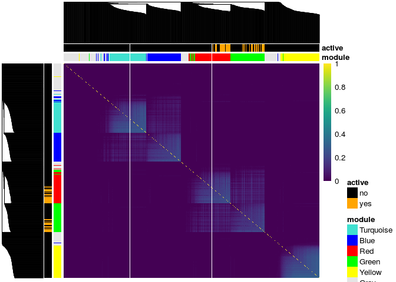

<script src="https://cdn.mathjax.org/mathjax/latest/MathJax.js"></script>
Plot Method for Object of class similarity
==========================================

There is a plot method for similarity matrices included in this package, though it is very specific to the simulated data only since the resulting plot annotates the true cluster membership of the genes. The plot uses the `pheatmap` package for the heatmaps along with the `viridis` package for the color scheme so these packages need to be installed prior to using this function.

The plot method is for objects of class `similarity`. The following objects, which are outputs of the `s_generate_data` function, are objects of class `similarity`:

<table style="width:21%;">
<colgroup>
<col width="20%" />
</colgroup>
<thead>
<tr class="header">
<th align="center">object.name</th>
</tr>
</thead>
<tbody>
<tr class="odd">
<td align="center">tom_train_all</td>
</tr>
<tr class="even">
<td align="center">tom_train_diff</td>
</tr>
<tr class="odd">
<td align="center">tom_train_e1</td>
</tr>
<tr class="even">
<td align="center">tom_train_e0</td>
</tr>
<tr class="odd">
<td align="center">corr_train_all</td>
</tr>
<tr class="even">
<td align="center">corr_train_diff</td>
</tr>
<tr class="odd">
<td align="center">corr_train_e1</td>
</tr>
<tr class="even">
<td align="center">corr_train_e0</td>
</tr>
<tr class="odd">
<td align="center">fisherScore</td>
</tr>
<tr class="even">
<td align="center">corScor</td>
</tr>
</tbody>
</table>

To plot the heatmap of the similarity matrix, you need to provide it with the clustering tree, the cluster membership and the genes active in the response. In this example we plot the TOM matrix for the exposed subjects given by the `tom_train_e1` object. The resulting heatmap has annotations for the cluster membership and if the gene is active in the response:

``` r
# check that the object is of class similarity
class(result$tom_train_e1)
```

    ## [1] "matrix"     "similarity"

``` r
# get clustering tree
hc <- hclust(as.dist(1 - result$tom_train_e1), method = "average")

plot(result$tom_train_e1, 
     truemodule = truemodule1, 
     cluster_rows = hc, 
     cluster_cols = hc,
     active = as.numeric(betaMainEffect!=0))
```


